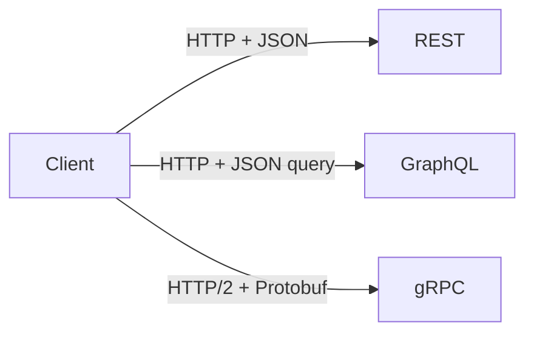
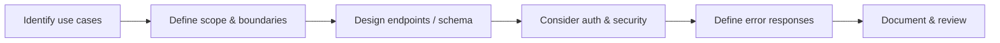

An API (Application Programming Interface) defines how software components interact. Good API design hides implementation details — callers don't need to know how something works, just how to ask for it.

## The Three Common Styles



| Style | Best For | Key Trait |
|---|---|---|
| **REST** | Web & mobile apps | Simple, stateless, widely understood |
| **GraphQL** | Complex UIs with varied data needs | Client asks for exactly what it needs |
| **gRPC** | Internal microservices | Fast binary protocol, strongly typed |

### REST
Resources modelled as URLs, actions expressed via HTTP verbs.
```
GET    /users/42        → fetch user
POST   /users           → create user
PUT    /users/42        → replace user
PATCH  /users/42        → partial update
DELETE /users/42        → delete user
```

### GraphQL
Single endpoint. Client defines the shape of the response — no over-fetching or under-fetching.
```graphql
query {
  user(id: 42) {
    name
    email
    orders { total }
  }
}
```

### gRPC
Defined via `.proto` files. Generates typed client/server code. Great for high-throughput internal calls.

---

## Design Principles

**Consistency** — same naming conventions, same error format, same patterns throughout. Surprises cost time.

**Simplicity** — design around core use cases first. An API is hard to un-ship once public.

**Versioning** — plan for change from day one. Common approaches:
- URL: `/v1/users`
- Header: `Accept: application/vnd.api+json;version=1`

**Pagination** — never return unbounded lists.
- **Offset:** `?page=2&limit=20` — simple but slow on large datasets
- **Cursor:** `?after=eyJpZCI6NDJ9` — efficient, works well with infinite scroll

**Rate Limiting** — protect your service from abuse. Return `429 Too Many Requests` with a `Retry-After` header.

---

## The Design Process



1. **Identify use cases** — who calls this and what do they need?
2. **Define scope** — what is out of scope? Fewer endpoints = easier to maintain.
3. **Design endpoints** — model resources, not actions (REST) or define your schema (GraphQL/gRPC)
4. **Auth & security** — authentication (who are you?) and authorisation (what can you do?)
5. **Error responses** — consistent error shape matters as much as success responses
6. **Document** — OpenAPI/Swagger for REST, `.proto` for gRPC

---

## Security Essentials

- **Authentication** — verify identity (API keys, OAuth 2.0, JWT)
- **Authorisation** — verify permissions (scopes, roles)
- **Input validation** — never trust caller input; validate types, lengths, ranges
- **Rate limiting** — per user/IP to prevent abuse
- **HTTPS only** — never send credentials over plain HTTP

---

## Performance Tips

- **Caching** — use `Cache-Control` headers; cache stable responses at the CDN or client
- **Minimise payload** — only return fields the client needs
- **Reduce round trips** — batch endpoints or use GraphQL to fetch related data in one call
- **Compression** — gzip responses for large payloads
