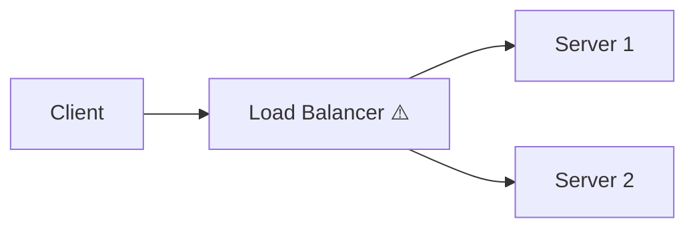
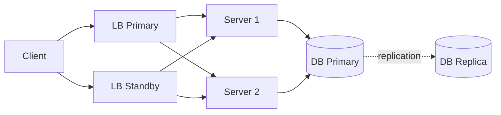
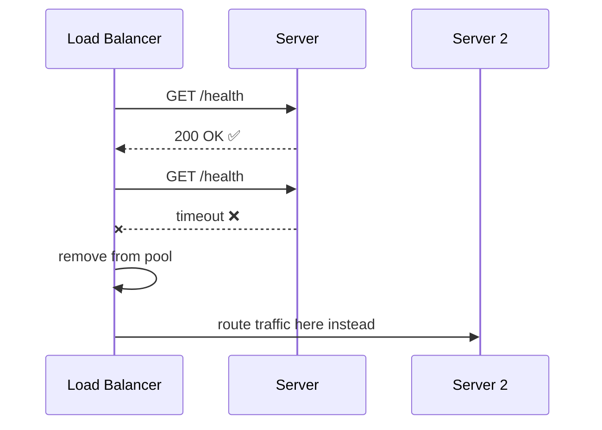

Any component in your system that, if it goes down, takes the entire system with it. The goal is to eliminate SPOFs by adding redundancy so no single failure causes an outage.

> If the load balancer has no backup, it's a SPOF — even though the servers are redundant.

## Common SPOFs

| Component | Risk | Fix |
|---|---|---|
| Load balancer | All traffic drops | Run primary + standby LB |
| Database | All reads/writes fail | Primary + replica(s) |
| DNS | Domain unreachable | Multiple DNS providers |
| Single server | Service down | Horizontal scaling |
| Single data centre | Regional outage | Multi-region deployment |

## How to Eliminate SPOFs

### Redundancy
Run multiple instances of every critical component. If one fails, others absorb the traffic.

### Active-Active vs Active-Passive

- **Active-Active** — all instances serve traffic simultaneously. Better throughput, instant failover.
- **Active-Passive** — one instance is on standby and only takes over when the primary fails. Simpler but wastes capacity.

### Health Checks
Automated checks that detect failures and trigger failover before users notice.

- **Passive** — monitors real traffic for errors/timeouts (no extra requests sent)
- **Active** — periodically pings an endpoint (e.g. `GET /health`) and expects a `200 OK`

If a node fails a health check a set number of times, it is removed from the pool automatically.

## Key Principle
> Assume everything will fail. Design so that when it does, the system degrades gracefully rather than going down completely.
