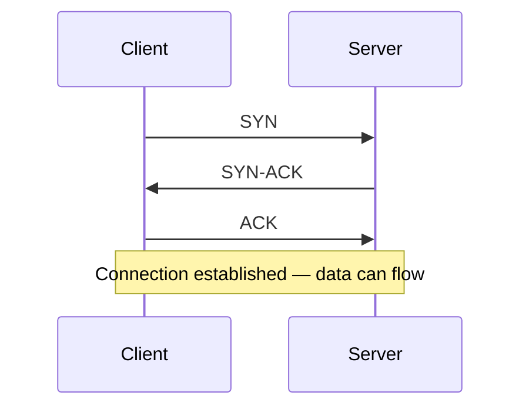
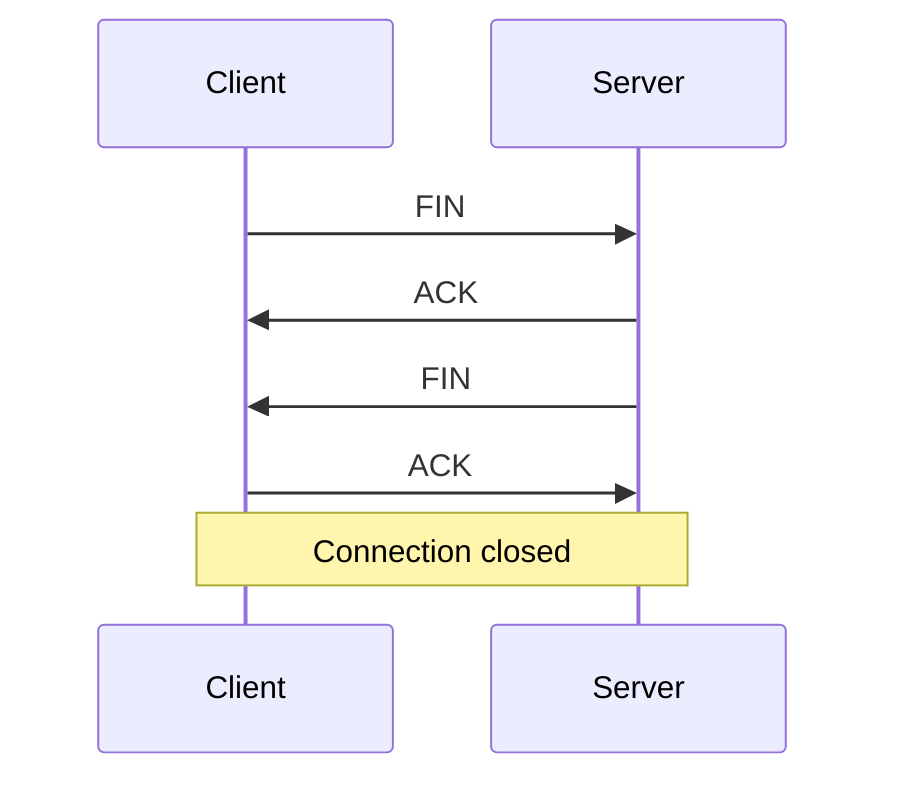
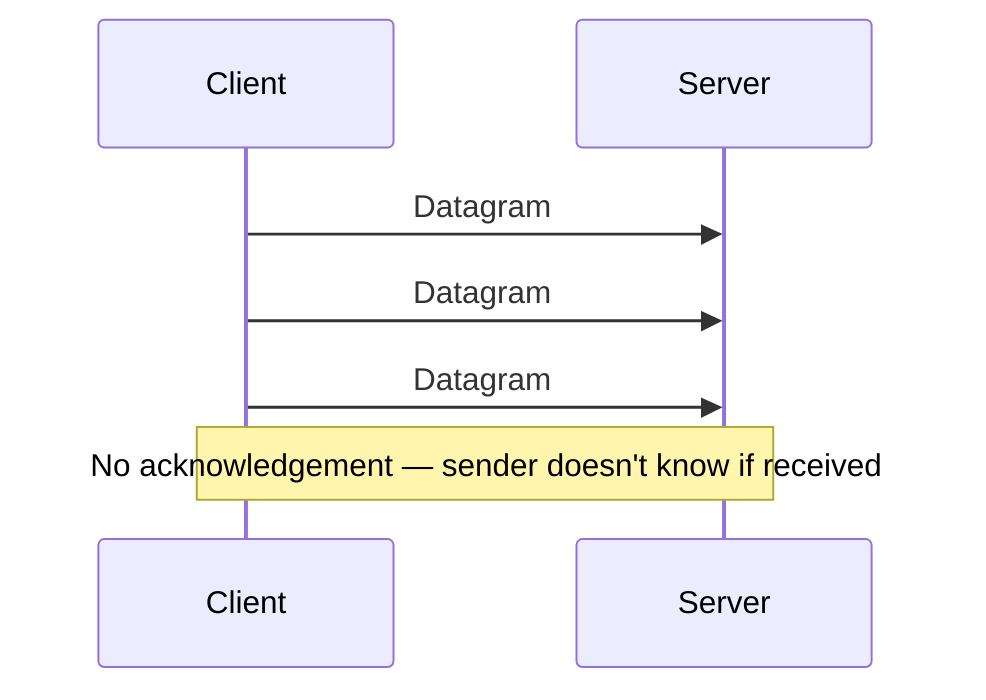

## Overview

TCP and UDP are the two transport-layer protocols everything else is built on. TCP trades speed for reliability; UDP trades reliability for speed.

## Core Concepts

### TCP — Transmission Control Protocol

Guarantees delivery, order, and error checking via a stateful connection.

**Three-way handshake** establishes the connection before any data is sent:



Every packet is acknowledged. If an ACK doesn't arrive, the sender retransmits. The receiver reassembles packets in order even if they arrive out of sequence.

**Four-way teardown** closes the connection cleanly:



**Key properties:**
- Guaranteed delivery — lost packets are retransmitted
- Ordered — receiver reassembles sequence regardless of arrival order
- Flow control — sender slows down if receiver's buffer is full
- Congestion control — sender backs off when the network is saturated
- Higher latency — handshake + ACKs add round trips

### UDP — User Datagram Protocol

Fire-and-forget. No handshake, no ACKs, no ordering guarantees.



**Key properties:**
- No connection setup — send immediately
- No retransmission — lost packets are gone
- No ordering — packets may arrive out of sequence or not at all
- Low overhead — smaller headers, no state to maintain
- Application controls reliability — if you need it, build it yourself (e.g. QUIC does this)

### Comparison

| | TCP | UDP |
|---|---|---|
| Connection | Stateful (handshake required) | Connectionless |
| Delivery | Guaranteed | Best-effort |
| Ordering | Guaranteed | Not guaranteed |
| Error checking | Yes + retransmit | Checksum only (no retransmit) |
| Latency | Higher | Lower |
| Overhead | Higher (headers + state) | Lower |
| Use cases | HTTP, email, file transfer, banking | Video streaming, gaming, DNS, VoIP |

### When to Use Each

**TCP** — whenever losing or reordering data is unacceptable:
- Financial transactions, payments
- File transfers, email (SMTP)
- Web (HTTP/1.1, HTTP/2 — both run over TCP)
- SSH, database connections

**UDP** — whenever speed matters more than perfection:
- Video/audio streaming — a dropped frame is better than buffering
- Online gaming — stale position data is useless; send fresh instead
- DNS lookups — single small request; faster to retry than to handshake
- VoIP — real-time; retransmitting old audio is pointless
- HTTP/3 (QUIC) — UDP with reliability built into the application layer

### QUIC — The Best of Both

HTTP/3 runs on QUIC, which is built on UDP but implements its own reliability, ordering, and encryption. This eliminates TCP's head-of-line blocking: a lost packet only stalls its own stream, not all streams on the connection.

```
TCP/TLS:  [stream 1][stream 2][stream 3] — one lost packet stalls everything
QUIC/UDP: [stream 1][stream 2][stream 3] — streams are independent
```

## Trade-offs

| Scenario | Choose |
|----------|--------|
| Data integrity is non-negotiable | TCP |
| Minimising latency over reliability | UDP |
| Real-time media (video, voice) | UDP |
| Modern web (HTTP/3) | UDP via QUIC |
| Internal microservice calls | TCP (gRPC over HTTP/2) |
